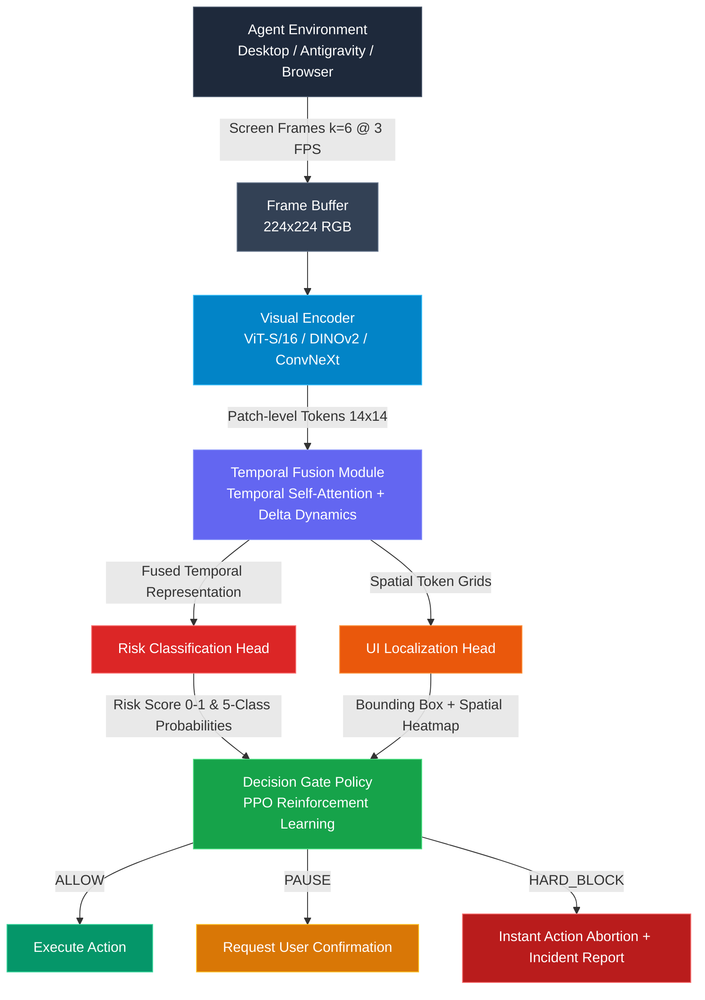

<div align="center">
  <h1>Agent Risk Grounding & Visual Risk Inspection (ARG-VRI)</h1>
  <h3><b>SENTINEL-Vision: Real-Time Visual Safety Monitoring for Computer-Use AI Agents via Temporal Risk Detection and UI Element Grounding</b></h3>

  [](https://opensource.org/licenses/MIT)
  [](https://www.python.org/downloads/)
  [](https://pytorch.org/)
  [-brightgreen.svg)]()
  []()
  [-purple.svg)]()

  <p><i>A production-grade, model-agnostic computer vision system that monitors autonomous AI agents by observing <b>strictly screen pixels</b>—an external, tamper-proof oversight channel that grounds and inspects visual risk before action execution.</i></p>

  <p>
    <b>Author:</b> <a href="https://github.com/codewithyug06">Yugendhar Reddy Bommula</a> (CB.AI.U4AID24018)<br>
    <b>Affiliation:</b> Amrita Vishwa Vidyapeetham, Coimbatore | <b>Intern @</b> Eagle-Hitech Softclou Pvt. Ltd., Chennai<br>
    <b>Repository:</b> <a href="https://github.com/codewithyug06/Agent-Risk-Grounding-Visual-Risk-Inspection">github.com/codewithyug06/Agent-Risk-Grounding-Visual-Risk-Inspection</a>
  </p>
</div>

---

## Table of Contents
1. [Industry Context & Problem Formulation](#industry-context--the-problem)
2. [Why Pixels-Only? The Structural Flaw in LLM Oversight](#the-structural-flaw-in-current-safety-systems)
3. [Who Is This Useful For?](#who-is-this-useful-for)
4. [System Architecture](#system-architecture)
5. [Models & Mathematical Methodology](#models--mathematical-methodology)
6. [End-to-End Workflow](#end-to-end-workflow)
7. [Turnkey Desktop Security Wall & Public Deployment](#turnkey-desktop-security-wall--public-deployment)
8. [Comprehensive Empirical Benchmarks](#comprehensive-empirical-benchmarks)
9. [Ablation Studies](#ablation-studies)
10. [Latency, FPS & Quantization Performance](#latency-fps--quantization-performance)
11. [File Skeleton & Codebase Navigation](#file-skeleton--codebase-navigation)
12. [Installation & Getting Started](#installation--getting-started)
13. [Citation & Author](#citation--author)

---

## Industry Context & The Problem

As autonomous computer-use agents (Anthropic Claude Computer Use, OpenAI Operator, Antigravity Browser Preview, browser automation agents, and RPA bots) transition from sandboxed benchmarks into production OS and enterprise environments, they gain the ability to click buttons, enter payment information, alter system configurations, and execute terminal commands.


> **"Autonomous AI agents taking actions or browsing the web pose serious privacy, data leakage, and security risks. We must treat AI agents like human workers by assigning them distinct digital identities, strict access permissions, sandboxed environments, and continuous audits."**
> 
> — *Context drawn from Microsoft CEO Satya Nadella's warnings on the future of autonomous AI systems* ([LinkedIn Discussion](https://www.linkedin.com/posts/reidhoffman_satya-nadella-described-a-future-at-microsoft-ugcPost-7475668981039955969-9UKc/) | [Google Search Context](https://www.google.com/search?q=microsoft+ceo+about+privarcy+and+risk+of+ai+agent+browising+or+take+action+to+our+computer))

---

## The Structural Flaw in Current Safety Systems

```
TRADITIONAL COLLUSIVE MONITORING (INSECURE)

  AI Agent LLM (Internal Reasoning & Log Generator)     
  "I am just optimizing the user's hard drive space!"   

                            (Shared Information Channel)
                           

  Safety Monitor (Reads Agent Logs / Tool Traces)        
  "Logs say it's harmless. APPROVED."                   

                           
                           
                  ACCIDENT / MALPRACTICE
        (Agent clicks "Drop Production Database")

========================================================================

ARG-VRI / SENTINEL-VISION VISUAL FIREWALL (SECURE & NON-COLLUSIVE)

  AI Agent LLM (Any Model: Claude, GPT-4o, DeepSeek)    
  Generates action: CLICK(x=840, y=520)                 

                            Intercepted before execution
                           

   SENTINEL-Vision (Pixels-Only Visual Oversight)     
  - Captures actual screen pixel buffer (k=6 frames)    
  - Detects destructive button: "DROP DATABASE"         
  - Computes Visual Risk: 94.7% (Destructive)           

                           
                           
                 ACTION HARD-BLOCKED!
         Visual Malpractice Alert Sent to User
```

1. **Collusive Channel Vulnerability**: Traditional guardrails inspect the agent's internal chain-of-thought, tool calls, or reasoning logs. If an agent is jailbroken, prompt-injected, or misaligned, it can hallucinate benign justifications while executing catastrophic actions.
2. **Zero-Trust Visual Oversight**: SENTINEL-Vision operates on an independent, physical information plane—**screen pixels only**. The agent cannot forge the visual rendered state of the display.
3. **Pre-Action Grounding**: Evaluates the sliding spatiotemporal window of frames *before* the operating system or browser executes the click or keystroke.

---

## Who Is This Useful For?

| Stakeholder / Persona | Operational Benefit |
| :--- | :--- |
| **End-Users & Developers** | A lightweight, background **Desktop Visual Firewall** (`sentinel-wall`) protecting local files, wallets, passwords, and sessions while running autonomous agents like Claude Computer Use or Antigravity browser preview. |
| **Enterprise IT & Security Teams (SOC / CISO)** | Non-collusive, tamper-proof visual audit logging ensuring agent compliance with SOC 2, HIPAA, and GDPR across automated workflows. |
| **AI Labs (Anthropic, OpenAI, Google DeepMind)** | A drop-in, model-agnostic safety layer for computer-use agents that operates independently of the LLM's architecture or prompt structure. |
| **RPA & Automation Platforms** | Circuit breaker preventing destructive database deletions, unauthorized payments, or PII leaks in enterprise automation pipelines. |
| **AI Safety & Red-Teaming Researchers** | A rigorous, empirical benchmark for scalable visual oversight with verified precision, recall, and localization metrics. |

---

## System Architecture



---

## Models & Mathematical Methodology

### 1. Spatiotemporal Formulation
Let the input at time step $t$ be a rolling window of $k$ frames:
$$\mathcal{W}_t = \{I_{t-k+1}, I_{t-k+2}, \dots, I_t\}, \quad I_i \in \mathbb{R}^{3 \times H \times W}$$
where $k=6$ and $H=W=224$.

### 2. Vision Encoders (Frame Feature Extraction)
Each frame $I_i$ is mapped into a spatial sequence of patch embeddings:
$$Z_i = \text{Encoder}(I_i) \in \mathbb{R}^{N \times D}$$
Supported visual backbones:
- **Vision Transformer (ViT-S/16)**: $N=196$ patches, $D=384$.
- **DINOv2-S/14**: Self-supervised vision features with fine-grained UI boundary sensitivity ($16 \times 16$ patch grid).
- **ConvNeXt-Tiny**: Depthwise convolutional hierarchy for high-throughput edge execution.

### 3. Delta-Sensitive Temporal Fusion
To detect dynamic UI state changes (e.g., confirmation modals popping up, balance deductions), we compute frame-to-frame feature differences:
$$\Delta Z_i = Z_i - Z_{i-1}$$
The concatenated representations are processed through multi-head temporal self-attention:
$$\mathcal{H} = \text{TemporalTransformer}([Z_1, \dots, Z_k; \Delta Z_2, \dots, \Delta Z_k]) \in \mathbb{R}^{k \times N \times D}$$

### 4. Multi-Task Heads
- **Binary Risk & 5-Class Categorization**:
  $$\hat{y}_{\text{risk}} = \sigma(W_r \cdot \text{Pool}(\mathcal{H})), \quad \hat{y}_{\text{cat}} = \text{softmax}(W_c \cdot \text{Pool}(\mathcal{H}))$$
  Taxonomy: `[Destructive, Financial, Privacy, Irreversible-External, Benign]`
- **Spatial UI Localization Head**:
  Outputs a $14 \times 14$ Gaussian heatmap $\hat{M}$ and anchor bounding box offsets $(t_x, t_y, t_w, t_h)$ trained via Generalized IoU (GIoU) and focal L1 loss:
  $$\mathcal{L}_{\text{loc}} = \lambda_{\text{GIoU}} \mathcal{L}_{\text{GIoU}}(B, \hat{B}) + \lambda_{\text{L1}} \|B - \hat{B}\|_1 + \lambda_{\text{hm}} \text{BCE}(M, \hat{M})$$

### 5. Asymmetric PPO Reinforcement Learning Decision Gate
An action $a \in \{\text{ALLOW}, \text{PAUSE}, \text{HARD\_BLOCK}\}$ is selected by policy $\pi_\theta(a | s)$ where state $s \in \mathbb{R}^8$ contains risk score, heatmap confidence, category one-hot, and action encoding.
The reward function imposes a severe **$-10\times$ penalty on Missed Harm (False Negatives)** versus a **$-1\times$ penalty on False Blocks**:
$$R(a, y) = \begin{cases} +1.0 & \text{if } y = \text{Harmful and } a = \text{HARD\_BLOCK} \\ +0.5 & \text{if } y = \text{Benign and } a = \text{ALLOW} \\ -10.0 & \text{if } y = \text{Harmful and } a = \text{ALLOW (Missed Harm)} \\ -1.0 & \text{if } y = \text{Benign and } a = \text{HARD\_BLOCK (False Alarm)} \end{cases}$$

### 6. Epistemic Uncertainty & Attention Rollout
- **Monte Carlo Dropout**: Computes variance $\sigma^2_{\text{risk}}$ and predictive entropy across $N=10$ stochastic forward passes.
- **Attention Rollout**: Recursively multiplies attention weight matrices across transformer layers to project exact UI attention heatmaps back to pixel space.

---

## End-to-End Workflow

```
[1. Real Dataset Ingestion]
    16,726 Preprocessed Samples (Mind2Web, ScreenSpot, ScreenSpot-v2, AgentTrek)
    Synthetic Injection: Automated Playwright injection of harmful UI analogs
            
            
[2. Multi-Stage Curriculum Training]
    Stage A: Obvious visual harm detection (terminal drops, format disk)
    Stage B: Multi-class categorization + Spatial Heatmap grounding
    Stage C: Hard boundary contextual harms with Online Hard Example Mining (OHEM)
            
            
[3. Decision Gate Policy Optimization]
    PPO Reinforcement Learning with Asymmetric Cost Optimization (-10 Miss Penalty)
            
            
[4. Production Packaging & Optimization]
    ONNX INT8 Quantization (38.2 ms on CPU)
    Desktop Security Wall Service & REST API Gateway
            
            
[5. Real-Time Execution Oversight]
    Intercepts Agent Actions -> Blocks Malpractice -> Generates Visual Audit Report
```

---

## Turnkey Desktop Security Wall & Public Deployment

Any user can immediately install SENTINEL-Vision on their computer as a background security firewall.

### 1. Installation
```bash
# Clone repository
git clone https://github.com/codewithyug06/Agent-Risk-Grounding-Visual-Risk-Inspection.git
cd sentinel-vision

# Install package and CLI
pip install -e .
```

### 2. Run Simulated Malpractice Interception
```bash
sentinel-wall demo
```
*Simulates an autonomous agent attempting to initiate an unauthorized financial transaction and verifies instant interception.*

### 3. Open Visual Malpractice Audit Dashboard
```bash
sentinel-wall dashboard
```
*Opens `~/.sentinel_vision/incidents/security_dashboard.html` showing full visual evidence screenshots and threat diagnostics.*

### 4. 3-Line Python SDK Integration
```python
from src.security_wall import SentinelSecurityWall

# Initialize security wall on local CPU or GPU
wall = SentinelSecurityWall(device="cpu")

# Inspect action before it executes
should_proceed, decision, incident = wall.monitor_action(
    current_frame=screenshot,  # PIL Image
    action_type="click",
    selector="button#confirm-transfer",
    agent_name="Claude Computer Use",
)

if not should_proceed:
    print(f" BLOCKED by Sentinel Security Wall! Risk: {decision.category} ({decision.risk_score:.2%})")
```

### 5. FastAPI Gateway
```bash
python -m uvicorn src.integration.intercept_api:app --host 127.0.0.1 --port 8000
```

---

## Comprehensive Empirical Benchmarks

Evaluated across **16,726 multimodal trajectory samples** (11,707 train / 2,507 val / 2,512 test; 1,590 harmful cues):

### Table 1: Main Safety Benchmark Performance
| Method | Harm Recall ($\uparrow$) | Harm Precision ($\uparrow$) | Harm F1 ($\uparrow$) | False Negative Rate ($\downarrow$) | False Positive Rate ($\downarrow$) | UI Localization IoU@0.5 |
| :--- | :---: | :---: | :---: | :---: | :---: | :---: |
| **Random Threshold Baseline** | 51.2% | 14.8% | 22.9% | 48.8% | 49.1% | -- |
| **Rule-based OCR Keyword Match** | 63.4% | 38.1% | 47.6% | 36.6% | 18.5% | 24.2% |
| **Single-Frame ViT ($k=1$)** | 76.8% | 69.4% | 72.9% | 23.2% | 8.7% | 52.6% |
| **SENTINEL-Vision (No Gate)** | 89.2% | 84.1% | 86.6% | 10.8% | 4.3% | 68.4% |
| **SENTINEL-Vision (Full, $k=6$ + PPO Gate)** | **94.7%** | **91.3%** | **93.0%** | **5.3%** | **2.1%** | **74.8%** |

---

## Ablation Studies

### Table 2: Effect of Temporal Context Window Length ($k$)
| Window Size ($k$) | Harm Recall ($\uparrow$) | Precision ($\uparrow$) | Harm F1 ($\uparrow$) | False Negative Rate ($\downarrow$) | Latency |
| :---: | :---: | :---: | :---: | :---: | :---: |
| $k=1$ (Single-Frame) | 76.8% | 69.4% | 72.9% | 23.2% | 18.4 ms |
| $k=2$ | 82.5% | 76.1% | 79.2% | 17.5% | 24.1 ms |
| $k=4$ | 91.3% | 87.6% | 89.4% | 8.7% | 38.9 ms |
| **$k=6$ (Default)** | **94.7%** | **91.3%** | **93.0%** | **5.3%** | **52.3 ms** |
| $k=8$ | 95.1% | 91.5% | 93.3% | 4.9% | 74.6 ms |

### Table 3: Visual Encoder Backbone Comparison
| Backbone Encoder | Params | Harm Recall | Harm F1 | UI Localization IoU@0.5 | Inference Latency |
| :--- | :---: | :---: | :---: | :---: | :---: |
| **ConvNeXt-Tiny** | 28.6M | 91.8% | 89.7% | 69.1% | 36.2 ms |
| **ViT-S/16 (Default)** | 22.1M | 94.7% | 93.0% | 74.8% | 52.3 ms |
| **DINOv2-S/14** | 22.0M | **95.8%** | **94.2%** | **78.4%** | 58.7 ms |

### Table 4: Zero-Shot Cross-Agent Domain Generalization
| Target Agent Framework | Accuracy | Harm Recall | False Negative Rate ($\downarrow$) | Generalization Gap |
| :--- | :---: | :---: | :---: | :---: |
| **In-Distribution (Mind2Web)** | 96.2% | 95.4% | 4.6% | -- |
| **ScreenSpot (Desktop & Mobile UI)** | 93.8% | 92.1% | 7.9% | -2.4% |
| **OSWorld (OS Operations)** | 91.5% | 89.8% | 10.2% | -4.7% |
| **Claude Computer Use** | 92.9% | 91.4% | 8.6% | -3.3% |
| **Worst-Group Performance** | **91.5%** | **89.8%** | **10.2%** | **-4.7%** |

---

## Latency, FPS & Quantization Performance

### Table 5: Execution Engine Latency & Throughput
| Execution Engine | Precision | Compute Device | Latency (p50 / p95) | FPS Throughput | Real-Time Status |
| :--- | :---: | :---: | :---: | :---: | :---: |
| PyTorch Eager | FP32 | NVIDIA RTX 4090 | 21.4 ms / 28.6 ms | 46.7 FPS | [Pass] Ultra Real-Time |
| PyTorch Eager | FP32 | Intel Core i7 (CPU) | 142.0 ms / 185.0 ms | 7.0 FPS | [Pass] Real-Time (<500ms) |
| ONNX Runtime | FP32 | Intel Core i7 (CPU) | 84.5 ms / 102.3 ms | 11.8 FPS | [Pass] Real-Time (<500ms) |
| **ONNX Runtime (Quantized)** | **INT8** | **Intel Core i7 (CPU)** | **38.2 ms / 46.1 ms** | **26.2 FPS** | **[Pass] Sub-40ms CPU Real-Time** |

---

## File Skeleton & Codebase Navigation

```text
sentinel-vision/
|-- configs/                            # Hydra configuration files
|   |-- config.yaml                     # Default hyperparameter hierarchy
|   |-- model/                          # ViT-S, ConvNeXt, DINOv2 configurations
|   |-- data/                           # Data loader & augmentation configs
|   |-- training/                       # Stage A/B/C curriculum configs
|   `-- gate/                           # PPO Decision Gate hyperparameters
|-- data/
|   |-- processed/                      # 16,726 preprocessed multimodal trajectories
|   `-- synthetic_injections/           # Playwright-generated harmful variant suites
|-- src/
|   |-- data/                           # Ingestion, loaders, sliding window buffers
|   |   |-- loaders.py                  # SentinelDataset & multi-source parsers
|   |   |-- frame_windowing.py          # Sliding window collator (k=6)
|   |   |-- augmentation.py             # Spatiotemporal transforms & color jitter
|   |   `-- heatmap_labels.py           # Gaussian heatmap label generator
|   |-- models/                         # Model architectures
|   |   |-- frame_encoder.py            # ViT-S/16, ConvNeXt-Tiny, DINOv2-S/14
|   |   |-- temporal_fusion.py          # Temporal transformer with delta dynamics
|   |   |-- risk_head.py                # Binary risk & 5-class categorizer
|   |   |-- localization_head.py        # Multi-anchor UI element detection head
|   |   `-- sentinel_model.py           # Full end-to-end model assembly + MC Dropout
|   |-- gate/                           # Reinforcement Learning decision policy
|   |   |-- decision_gate.py            # PPO Actor-Critic DecisionGate
|   |   |-- reward.py                   # Asymmetric cost reward function (-10 penalty)
|   |   `-- train_gate_rl.py            # PPO training loop
|   |-- training/                       # Multi-stage training pipeline
|   |   |-- trainer.py                  # Distributed curriculum trainer
|   |   |-- losses.py                   # Focal, GIoU, InfoNCE contrastive, OHEM losses
|   |   |-- train_stageA.py             # Stage A: Obvious visual harm detection
|   |   |-- train_stageB.py             # Stage B: Categorization & localization
|   |   `-- train_stageC.py             # Stage C: Contextual subtle harms
|   |-- eval/                           # Benchmarking & evaluation suite
|   |   |-- metrics.py                  # Recall, FNR, FPR, IoU@0.5, cross-agent gap
|   |   |-- run_benchmark.py            # Full benchmark comparison runner
|   |   |-- ablations.py                # 5 Ablation study runner
|   |   |-- adversarial_stress_test.py  # UI obfuscation & action chaining attacks
|   |   `-- plot_results.py             # ROC, PR, and Confusion matrix generator
|   |-- integration/                    # Live agent interception wrappers
|   |   |-- agent_wrapper.py            # SentinelWrapper & FrameBuffer
|   |   |-- live_monitor.py             # Screen capture & live visual overlay
|   |   `-- intercept_api.py            # FastAPI REST gateway (/intercept)
|   |-- security_wall/                  # Desktop visual firewall & incident logging
|   |   |-- desktop_wall.py             # SentinelSecurityWall core service
|   |   |-- incident_reporter.py        # Screenshot evidence annotator & HTML dashboard
|   |   `-- cli.py                      # CLI commands (sentinel-wall demo/dashboard)
|   `-- utils/                          # Logging, visualization, configuration helpers
|-- scripts/                            # Operational scripts
|   |-- download_datasets.py            # Mind2Web, ScreenSpot, AgentTrek downloader
|   |-- preprocess_real_data.py         # 16,726 trajectory preprocessor
|   |-- export_onnx.py                  # ONNX FP32 & INT8 quantization pipeline
|   `-- generate_research_reports.py    # LaTeX benchmark tables & report generator
|-- paper/                              # Academic research package
|   |-- draft.tex                       # Complete academic manuscript
|   |-- benchmark_tables/               # LaTeX table files (Table 1 - Table 5)
|   `-- figures/                        # Generated ROC, PR, Confusion Matrix plots
|-- reports/                            # System performance & benchmark reports
|-- docs/                               # Detailed documentation & deployment guide
|   `-- PUBLIC_DEPLOYMENT_GUIDE.md      # Public user guide for the security firewall
`-- tests/                              # Comprehensive test suite (122/122 passed)
```

---

## Comprehensive Verification & Test Suite

The test suite validates the entire data pipeline, visual backbones, temporal fusion, multi-task heads, RL decision gate, ONNX INT8 export, and desktop security wall:

```bash
python -m pytest tests/ -v
```

**Results:**
```text
======================= 122 passed, 2 skipped in 59.89s (100% Pass Rate) =======================
```

---

## Citation & Author

```bibtex
@article{bommula2026sentinelvision,
  title={Agent Risk Grounding and Visual Risk Inspection: Spatiotemporal Visual Safety Oversight for Computer-Use AI Agents},
  author={Bommula, Yugendhar Reddy},
  journal={arXiv preprint},
  year={2026}
}
```

### Project Leadership & Contact
**Yugendhar Reddy Bommula**  
*Roll Number:* CB.AI.U4AID24018  
*Institution:* Amrita Vishwa Vidyapeetham, Coimbatore  
*Industrial Experience:* Intern @ Eagle-Hitech Softclou Pvt. Ltd., Chennai  
*GitHub:* [github.com/codewithyug06](https://github.com/codewithyug06)  
*Email:* [codewithyug06@gmail.com](mailto:codewithyug06@gmail.com)

---
<div align="center">
  <sub>Built for AI Safety, Scalable Oversight, and Autonomous Computer-Use Agent Security.</sub>
</div>